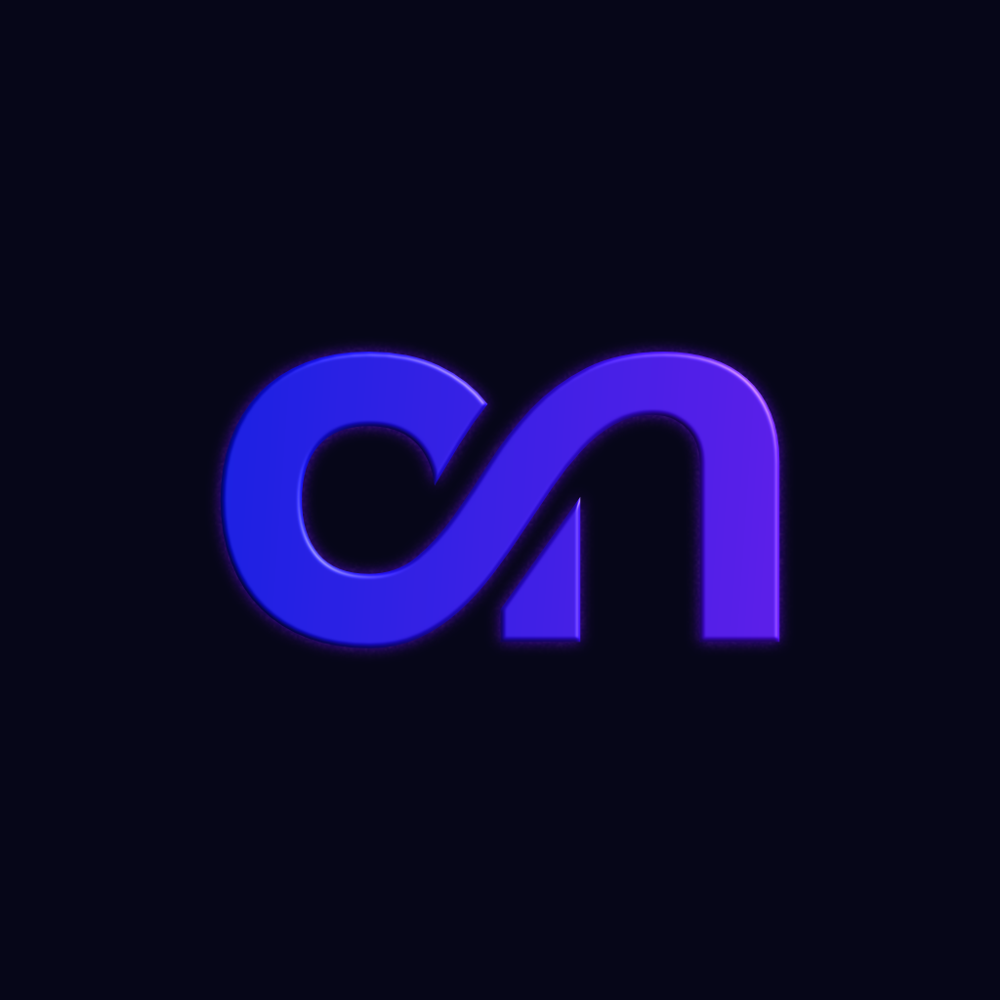
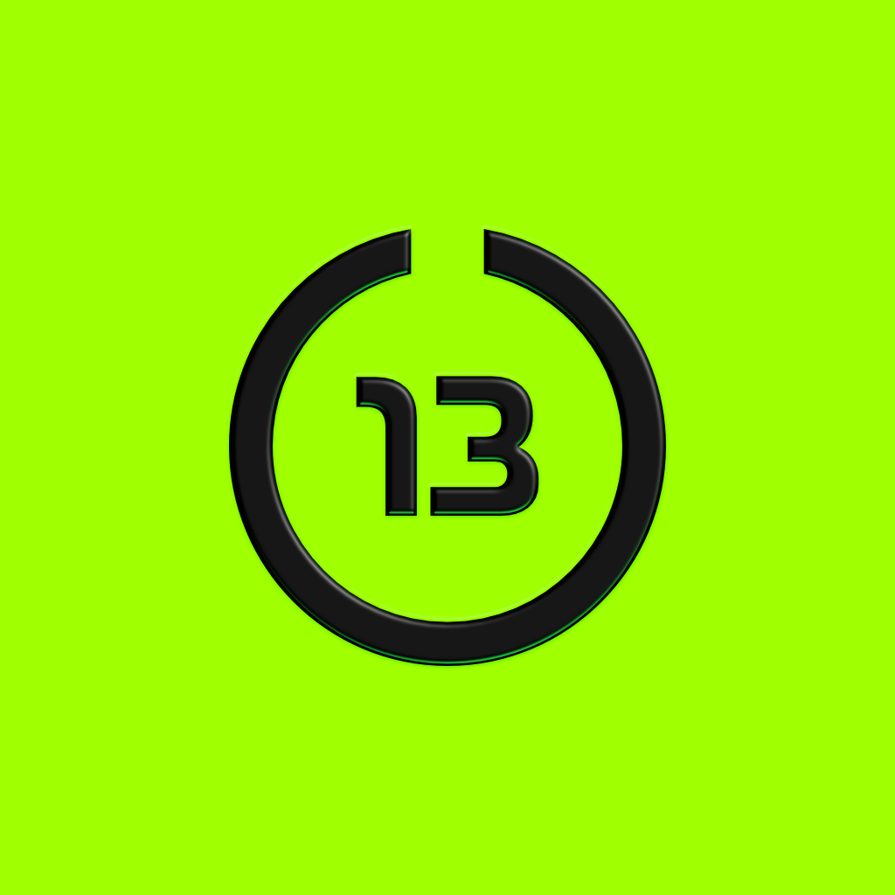

# NexaUI

<p align="center">
  
</p>

> Native-first, token-driven UI foundation for the Obsidian ecosystem.

```
Applications
  /      |       \
Lumora  MoonPlayer  Docer
  \      |       /
      NexaUI
        |
     NexaCore
```

NexaUI is the shared design-system layer for all Obsidian apps. It provides composable, theme-aware primitives built on React Native — Expo compatible, framework-agnostic, and media-aware.

## Philosophy

1. **Native-first** — React Native primitives, iOS + Android first, Expo supported not required.
2. **Composable** — Compound components over prop-heavy APIs.
3. **Token-based** — Every visual decision flows through design tokens.
4. **Theme engine** — Light/dark/system + custom themes + dynamic tokens.
5. **Media-aware** — First-class primitives for audio/video experiences.

## Install

```bash
npm install @obsidian_north/nexaui
# or
pnpm add @obsidian_north/nexaui
```

Peer deps: `react >=18`, `react-native >=0.73`. Optional: `react-native-reanimated`, `react-native-gesture-handler`, `react-native-svg`.

## Quick start

```tsx
import { NexaProvider, useTheme } from '@obsidian_north/nexaui';

export default function App() {
  return (
    <NexaProvider theme="system">
      <Home />
    </NexaProvider>
  );
}

function Home() {
  const { theme, tokens } = useTheme();
  return null; // Phase 2: <NexaText>, <NexaCard>, <Stack> ...
}
```

Custom theme:

```tsx
import { createTheme, NexaProvider } from '@obsidian_north/nexaui';

const customTheme = createTheme({
  colors: { primary: '#7C3AED' },
  radius: { md: 14 },
});

<NexaProvider theme={customTheme}>...</NexaProvider>
```

## Roadmap

- **Phase 1** — Package architecture, tokens, theme provider (current)
- **Phase 2** — Text, Icon, Button, Card, Stack, Row, Input, Divider
- **Phase 3** — Modal, Dialog, BottomSheet, Toast, animations
- **Phase 4** — Media + navigation components

## Structure

```
src/
  tokens/       # spacing, radius, typography, elevation, opacity, animation, colors
  theme/        # provider, presets, types, utilities
  components/   # Phase 2+
  layout/       # Stack, Row, Column, Center, Spacer, Container
  navigation/   # TabBar, Header, TopBar
  media/        # MediaCard, AlbumArt, MiniPlayer, Waveform ...
  hooks/
  animations/
  icons/
  utils/
```

## Developers

| Thirteen Labs | Obsidian Northern |
| :---: | :---: |
|  |  |

## License

MIT — Obsidian North
